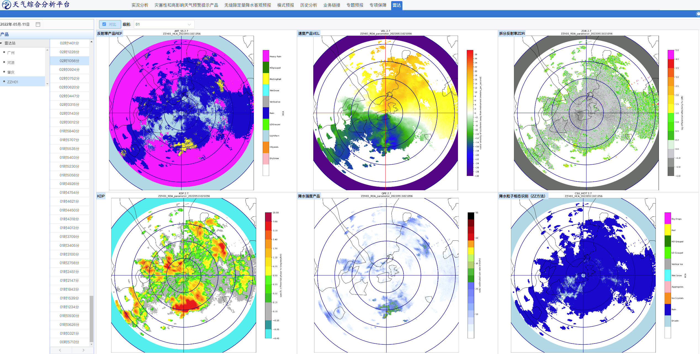
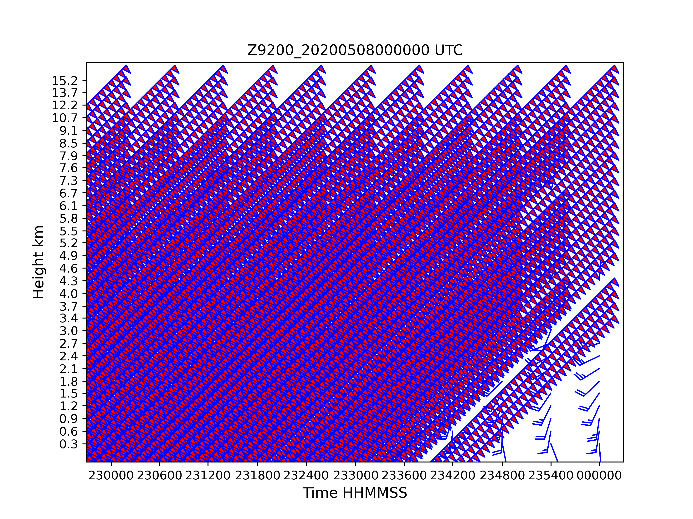

# radar_analysis
- CINRAD VWP48 Processing.
- Decoder according to NEXRAD Level3 VWP-48 product.
- Adding S/X Dpol-Radar products, ZDR, KDP, CC and HCA.
- Using CMA-MESO temperatrue for HCA algorithm.

# Radar reflectivity factor 0-2h forecast in South China

# Guangdong Zhuhai X-band Radar products in NMC

# X-band Radar HCA RHI

# S-band Radar HCA PPI

# VAD wind profile example

# VWP with model data

